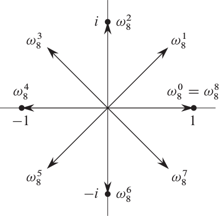

# 用 FFT 计算多项式乘法

给定两个多项式

$$
\begin{aligned}
A(x)&=\sum_{k=0}^{n-1}a_kx^k,\\
B(x)&=\sum_{k=0}^{m-1}b_kx^k,
\end{aligned}
$$

的系数 $\left(a_0,a_1,\cdots,a_{n-1}\right)$ 和 $\left(b_0,b_1,\cdots,b_{m-1}\right)$ ，我们希望求出多项式

$$
C(x)=A(x)B(x)=\sum_{k=0}^{n+m-2}c_kx^k
$$

的各项系数

$$
c_k=\sum_{i+j=k}a_ib_j,\quad k\in\{0,1,\cdots,n+m-2\}.
$$

首先，为了简化问题，我们假定 $m=n$ ，并且 $n$ 是 $2$ 的正整数次幂。实际情况中，这两点都可以通过给后面补上若干个 $0$ 来完成。

## 点值表示法 (point-value representation)

通过一个系数向量 $\left(a_0,a_1,\cdots,a_{n-1}\right)$ 来表示一个多项式的方式称为**系数表示法**。系数表示法让我们可以很容易地在 $O(n)$ 的时间里求出多项式在某一点处的值，但是用它来计算多项式的乘积是比较麻烦的。

注意到，给定平面上的 $n$ 个点 $\left(x_0,y_0\right),\left(x_1,y_1\right),\cdots,\left(x_{n-1},y_{n-1}\right)$ ，其中所有 $x_i$ 都不相等，这 $n$ 个点可以唯一确定一个不超过 $n-1$ 次的多项式，比如 $2$ 个点可以确定一条直线， $3$ 个不共线的点可以确定一条抛物线。因此我们还有一种表示多项式 $A(x)$ 的方式：

$$
\left(x_0,A\left(x_0\right)\right),\left(x_1,A\left(x_1\right)\right),\cdots,\left(x_{n-1},A\left(x_{n-1}\right)\right),\quad i\neq j\implies x_i\neq x_j.
$$

这种表示方式称为**点值表示法**。给定两个多项式 $A(x)$ 和 $B(x)$ 的点值表示，我们可以很容易地在 $O(n)$ 的时间内求出它们的乘积 $C(x)$ 的点值表示，因为 $C\left(x_k\right)=A\left(x_k\right)B\left(x_k\right)$ 。

所以我们的思路就是：给定 $A(x)$ 和 $B(x)$ 的系数表示，先快速地求出它们的点值表示，然后花 $O(n)$ 的时间算出它们的乘积 $C(x)$ 的点值表示，再快速地求出 $C(x)$ 的系数表示。

## 离散傅里叶变换 (Discrete Fourier Transform)

要想快速地求出 $A(x)$ 和 $B(x)$ 的点值表示，点 $x_0,x_1,\cdots$ 的选取至关重要。

> 从现在开始，我们用 $i$ 表示虚数单位。

首先引入**单位根** (root of unity) 的概念。一个 $n$ 次单位根指的是一个复数 $\omega$ ，满足

$$
\omega^n=1.
$$

这个方程在复数域恰好有 $n$ 个解，所以 $n$ 次单位根恰好有 $n$ 个，其中第 $k$ 个 ($0\leqslant k<n$) 是 $e^{2\pi ik/n}$ 。我们可以用著名的欧拉公式 $e^{ix}=\cos x+i\sin x$ 来理解它：

$$
e^{2\pi ik/n}=\cos\frac{2\pi k}{n}+i\sin\frac{2\pi k}{n}.
$$

它的主辐角恰好为 $2\pi\cdot\dfrac kn$ ，所以 $n$ 个单位根均匀地分布在以复平面的原点为圆心的单位圆上，如图所示：

值 $\omega_n=e^{2\pi i/n}$ 称为**主 $n$ 次单位根**，所有其它 $n$ 次单位根都是 $\omega_n$ 的幂，所以第 $k$ 个 $n$ 次单位根恰好是 $\omega_n^k$ 。

$n$ 个 $n$ 次单位根 $\omega_n^0,\omega_n^1,\cdots,\omega_n^{n-1}$ 在乘法意义下构成一个群，这个群和模 $n$ 意义下的整数加法群 $\left(\mathbb Z_n,+\right)$ 具有相同的结构，因为 $\omega_n^n=\omega_n^0=1$ 意味着 $\omega_n^j\omega_n^k=\omega_n^{j+k}=\omega_n^{(j+k)\bmod n}$ 。类似地， $\omega_n^{-1}=\omega_n^{n-1}$ 。

多项式 $A(x)$ 在 $\omega_n^0,\omega_n^1,\cdots,\omega_n^{n-1}$ 这 $n$ 个点处的值

$$
y_k=A\left(\omega_n^k\right)=\sum_{j=0}^{n-1}a_j\omega_n^{jk},\quad 0\leqslant k<n
$$

构成的向量 $\left(y_0,y_1,\cdots,y_{n-1}\right)$ 称为系数向量 $\left(a_0,a_1,\cdots,a_{n-1}\right)$ 的**离散傅里叶变换**。

## 快速傅里叶变换 (Fast Fourier Transform)

注意，尽管 $A(x)$ 和 $B(x)$ 各只需要 $n$ 个点就能确定，但是 $C(x)$ 的次数是 $2n-2$ ，它的点值表示至少需要 $2n-1$ 个点。为了方便，我们选取 $2n$ 个点，并且假设这些多项式都各具有 $2n$ 个系数，其中 $a_n=a_{n+1}=\cdots=a_{2n-1}=0$ 以及 $b_n=b_{n+1}=\cdots=b_{2n-1}=0$ 。

考虑求出多项式 $A(x)$ 在 $\omega_{2n}^0,\omega_{2n}^1,\cdots,\omega_{2n}^{2n-1}$ 这 $2n$ 个点处的值，即求出 $\left(y_0,y_1,\cdots,y_{2n-1}\right)$ ，其中

$$
y_k=A\left(\omega_{2n}^k\right)=\sum_{j=0}^{2n-1}a_j\omega_{2n}^{kj},\quad 0\leqslant k<2n.
$$

如果直接计算，求一个 $y_k$ 需要 $\Theta(n)$ 的时间，所以求出 $\left(y_0,y_1,\cdots,y_{2n-1}\right)$ 的时间复杂度为 $\Theta\left(n^2\right)$ 。

下面介绍一种快速算法，即**快速傅里叶变换**。对 $0\leqslant k<2n$ ，我们有

$$
\begin{aligned}
A\left(\omega_{2n}^k\right)
&= \sum_{j=0}^{2n-1}a_j\omega_{2n}^{kj}\\
&= \sum_{j=0}^{n-1}a_{2j}\omega_{2n}^{k\cdot(2j)}+\sum_{j=0}^{n-1}a_{2j+1}\omega_{2n}^{k(2j+1)}\\
&= \sum_{j=0}^{n-1}a_{2j}\omega_{2n}^{2kj}+\omega_{2n}^k\sum_{j=0}^{n-1}a_{2j+1}\omega_{2n}^{2kj}\\
&= \sum_{j=0}^{n-1}a_{2j}\omega_{n}^{kj}+\omega_{2n}^k\sum_{j=0}^{n-1}a_{2j+1}\omega_{n}^{kj}.
\end{aligned}
$$

这里的最后一步是因为 $\omega_{2n}^{2kj}=\omega_n^{kj}$ 。令 $A_0(x)$ 和 $A_1(x)$ 为两个各有 $n$ 个系数的多项式

$$
\begin{aligned}
A_0(x) &= \sum_{j=0}^{n-1}a_{2j}x^j=a_0+a_2x+a_4x^2+\cdots+a_{2n-2}x^{n-1},\\
A_1(x) &= \sum_{j=0}^{n-1}a_{2j+1}x^j=a_1+a_3x+a_5x^2+\cdots+a_{2n-1}x^{n-1},
\end{aligned}
$$

于是

$$
A\left(\omega_{2n}^k\right)=A_0\left(\omega_n^k\right)+\omega_{2n}^kA_1\left(\omega_n^k\right),\quad 0\leqslant k<n.\tag{1}
$$

并且注意到 $\omega_{2n}^{n+k}=-\omega_{2n}^k$ ，有

$$
\begin{aligned}
A\left(\omega_{2n}^{n+k}\right)
&= \sum_{j=0}^{n-1}a_{2j}\omega_n^{(n+k)j}+\omega_{2n}^{n+k}\sum_{j=0}^{n-1}a_{2j+1}\omega_n^{(n+k)j}\\
&= \sum_{j=0}^{n-1}a_{2j}\omega_n^{kj}-\omega_{2n}^k\sum_{j=0}^{n-1}a_{2j+1}\omega_n^{kj}\\
&= A_0\left(\omega_n^k\right)-\omega_{2n}^kA_1\left(\omega_n^k\right),\quad 0\leqslant k<n.
\end{aligned}\tag{2}
$$

也就是说，我们可以先计算 $A_0\left(\omega_n^0\right),A_0\left(\omega_n^1\right),\cdots,A_0\left(\omega_n^{n-1}\right)$ 及 $A_1\left(\omega_n^0\right),A_1\left(\omega_n^1\right),\cdots,A_1\left(\omega_n^{n-1}\right)$ 这两个规模都只有原来的一半的子问题，然后利用 $(1)$ 和 $(2)$ 式求出 $A\left(\omega_{2n}^0\right),A\left(\omega_{2n}^1\right),\cdots,A\left(\omega_{2n}^{2n-1}\right)$ 。

设 $T(n)$ 为计算 $A\left(\omega_{2n}^0\right),A\left(\omega_{2n}^1\right),\cdots,A\left(\omega_{2n}^{2n-1}\right)$ 所需的时间，则我们有

$$
T(n)=2T(n/2)+\Theta(n),
$$

所以 $T(n)=\Theta\left(n\log n\right)$ 。

## 逆变换

现在我们已经能在 $\Theta(n\log n)$ 的时间里求出

$$
A\left(\omega_{2n}^0\right),A\left(\omega_{2n}^1\right),\cdots,A\left(\omega_{2n}^{2n-1}\right)
$$

和

$$
B\left(\omega_{2n}^0\right),B\left(\omega_{2n}^1\right),\cdots,B\left(\omega_{2n}^{2n-1}\right).
$$

我们可以轻易地在 $\Theta(n)$ 的时间里求出 $\left(\phi_0,\phi_1,\cdots,\phi_{2n-1}\right)$, 其中

$$
\phi_k=C\left(\omega_{2n}^k\right)=A\left(\omega_{2n}^k\right)B\left(\omega_{2n}^k\right),\quad 0\leqslant k<2n.
$$

现在的问题是，如何从 $\left(\phi_0,\phi_1,\cdots,\phi_{2n-1}\right)$ 得到 $C(x)$ 的系数表示？

注意到

$$
\phi_k=C\left(\omega_{2n}^k\right)=\sum_{j=0}^{2n-1}c_j\omega_{2n}^{kj}.
$$

设多项式 $\Phi(x)=\sum_{j=0}^{2n-1}\phi_jx^j$ 。我们发现

$$
\begin{aligned}
\Phi\left(\omega_{2n}^{-k}\right)
&= \sum_{j=0}^{2n-1}\phi_j\omega_{2n}^{-kj}\\
&= \sum_{j=0}^{2n-1}\sum_{t=0}^{2n-1}c_t\omega_{2n}^{j(t-k)}\\
&= \sum_{t=0}^{2n-1}c_t\sum_{j=0}^{2n-1}\omega_{2n}^{j(t-k)}.
\end{aligned}
$$

这里 $\sum_{j=0}^{2n-1}\omega_{2n}^{j(t-k)}$ 是等比数列求和，它的结果是

$$
\sum_{j=0}^{2n-1}\omega_{2n}^{j(t-k)}=\begin{cases}
\dfrac{1-\omega_{2n}^{2n(t-k)}}{1-\omega_{2n}^{t-k}}=\dfrac{1-1}{1-\omega_{2n}^{t-k}}=0,&\text{if }\omega_{2n}^{t-k}\neq 1,\\
2n,&\text{if }\omega_{2n}^{t-k}=1.
\end{cases}
$$

由于这里 $0\leqslant k,t\leqslant 2n-1$ ，如果 $\omega_{2n}^{t-k}=1$ ，那么 $t-k$ 必然为零，即 $t=k$ 。所以

$$
\Phi\left(\omega_{2n}^{-k}\right)=c_k\cdot 2n\implies c_k=\frac{1}{2n}\Phi\left(\omega_{2n}^{-k}\right),\quad 0\leqslant k<2n.\tag{3}
$$

因此，我们只需对 $\left(\phi_0,\phi_1,\cdots,\phi_{2n-1}\right)$ 求一次离散傅里叶变换，就能根据 $(3)$ 得出 $C(x)$ 的各项系数了。这里有两种可能的方式，你既可以使用

$$
c_k=\begin{cases}
\dfrac{1}{2n}\Phi\left(\omega_{2n}^{2n-k}\right),&0<k<2n,\\[1em]
\dfrac{1}{2n}\Phi\left(\omega_{2n}^0\right),&k=0,
\end{cases}
$$

也可以在求 DFT 的过程中使用 $\omega_{2n}^{-k}$ 代替 $\omega_{2n}^k$ 。

## 实现

C++ 标准库 `<complex>` 中有一个复数模板 `std::complex` ，您可以在[这里](https://en.cppreference.com/w/cpp/numeric/complex)看到它的使用方式。您还可以使用 [`std::polar`](https://en.cppreference.com/w/cpp/numeric/complex/polar) 来方便地求单位根。

C++ 标准库 `<numbers>` 中还有 `std::numbers::pi` 等数学常量，详见[文档](https://en.cppreference.com/w/cpp/numeric/constants)。

您可以按照上述算法描述实现一个递归版本的 FFT ，也可以采用某些更精妙的非递归版的实现。您可以参考网络上的一些资料，但是您必须真正理解您提交的代码的每一个细节，不能只是从网上复制粘贴一份了事。